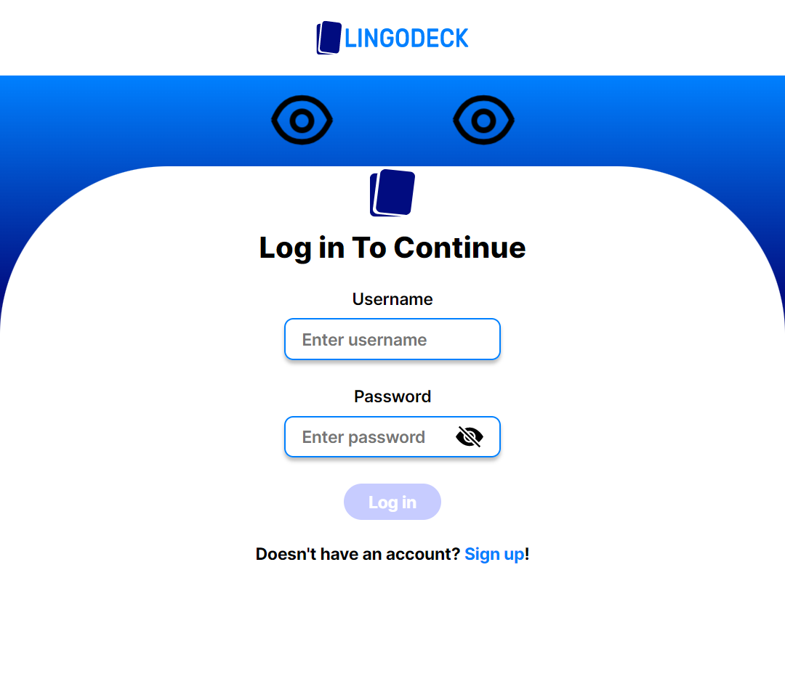

# **LINGODECK**

**_LingoDeck_** is a language learning platform designed to help you memorize words and phrases in a new language using a spaced repetition mechanism.

You can create a vocabulary card with a front and a back and add an image to it. The cards can be filtered by language.

[Click here to go to the LingoDeck website.](https://lingodeckfront.netlify.app/)

**Implementation details**

I have used Vite as a development tool with the Vue framework to build the user interface. The application state is managed through Pinia.

As for code analysis, the application employs Typescript for type checking and ESLINT with Vue plugins for linting.

For unit or integration testing of each part of the program or subsets thereof, I have utilized Vitest + Vue Test Utils, with MSW for request interception.

 

## **Getting started**

---

- To start using LingoDeck, you need:
  - To install NodeJS.
  - To run `npm install` after cloning the repository locally.

**Running the app**: `npm run start`
 
**Running tests**: `npm run test`
